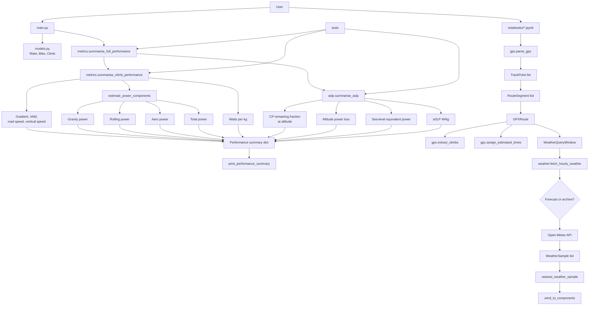
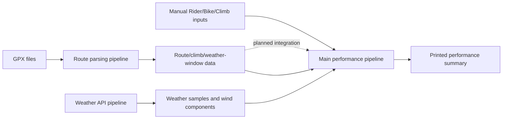

# Climbing Performance Process Diagram

```mermaid
flowchart TD
    User[User] --> Main[main.py]
    User --> Notebooks[notebooks/*.ipynb]

    Main --> Models[models.py<br/>Rider, Bike, Climb]
    Main --> FullSummary[metrics.summarise_full_performance]

    FullSummary --> ClimbSummary[metrics.summarise_climb_performance]
    ClimbSummary --> BasicMetrics[Gradient, VAM,<br/>road speed, vertical speed]
    ClimbSummary --> Power[estimate_power_components]
    Power --> Gravity[Gravity power]
    Power --> Rolling[Rolling power]
    Power --> Aero[Aero power]
    Power --> Total[Total power]
    ClimbSummary --> Wkg[Watts per kg]

    FullSummary --> ASLP[aslp.summarise_aslp]
    ASLP --> CPFraction[CP remaining fraction<br/>at altitude]
    ASLP --> AltLoss[Altitude power loss]
    ASLP --> SeaLevel[Sea-level equivalent power]
    ASLP --> ASLPWkg[aSLP W/kg]

    BasicMetrics --> Summary[Performance summary dict]
    Gravity --> Summary
    Rolling --> Summary
    Aero --> Summary
    Total --> Summary
    Wkg --> Summary
    CPFraction --> Summary
    AltLoss --> Summary
    SeaLevel --> Summary
    ASLPWkg --> Summary

    Summary --> Print[print_performance_summary]

    Notebooks --> GPXParse[gpx.parse_gpx]
    GPXParse --> TrackPoints[TrackPoint list]
    TrackPoints --> Segments[RouteSegment list]
    Segments --> GPXRoute[GPXRoute]
    GPXRoute --> Climbs[gpx.extract_climbs]
    GPXRoute --> TimeEstimate[gpx.assign_estimated_times]
    GPXRoute --> WeatherWindow[WeatherQueryWindow]

    WeatherWindow --> WeatherFetch[weather.fetch_hourly_weather]
    WeatherFetch --> SourceSelect{Forecast or archive?}
    SourceSelect --> OpenMeteo[Open-Meteo API]
    OpenMeteo --> Samples[WeatherSample list]
    Samples --> Nearest[nearest_weather_sample]
    Nearest --> Wind[wind_to_components]

    Tests[tests] --> ClimbSummary
    Tests --> FullSummary
    Tests --> ASLP
```

## Current Integration Shape

```mermaid
flowchart LR
    ManualInputs[Manual Rider/Bike/Climb inputs] --> MainPipeline[Main performance pipeline]
    MainPipeline --> Output[Printed performance summary]

    GPXFiles[GPX files] --> RoutePipeline[Route parsing pipeline]
    RoutePipeline --> RouteData[Route/climb/weather-window data]

    WeatherAPI[Weather API pipeline] --> WeatherData[Weather samples and wind components]

    RouteData -. planned integration .-> MainPipeline
    RouteData --> MainPipeline
    WeatherData --> MainPipeline
```
