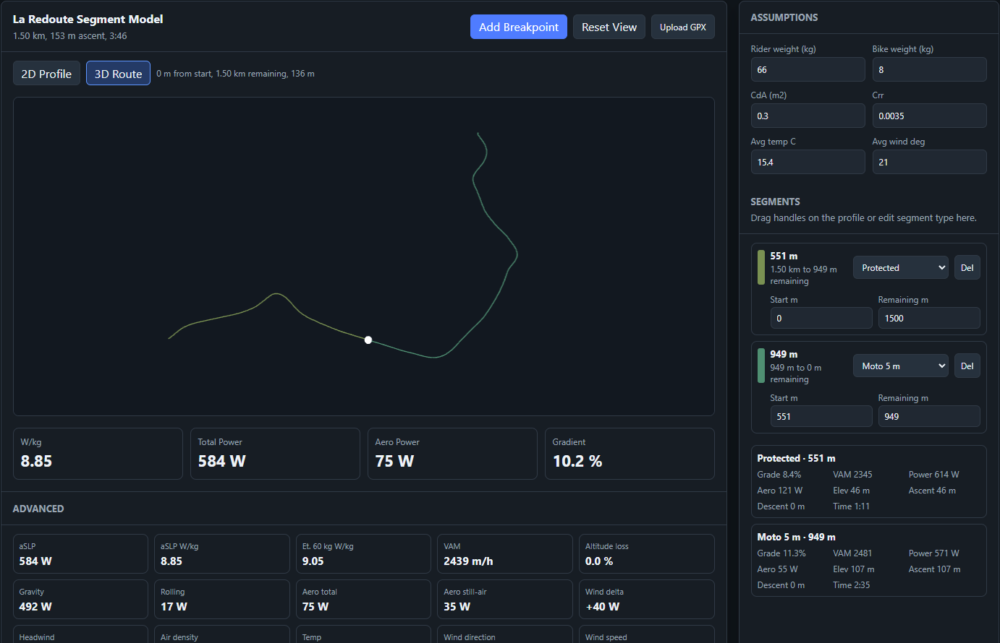
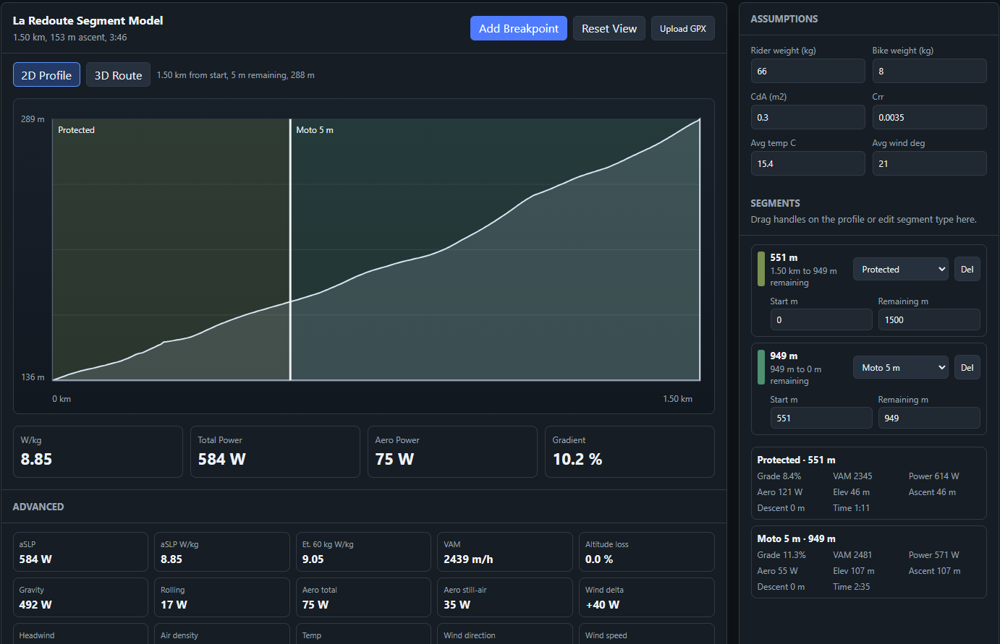
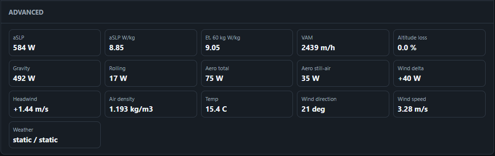

# Climbing Performance Estimator

A Python project focused on interactive performance modelling, route analysis, and scenario-based simulation for cycling climbs.

The project was developed as a technical exploration of applied physics modelling, geospatial processing, browser-based visualisation, and analytical workflow design. Rather than functioning as a consumer training application, the repository exists primarily as a demonstration of software engineering, data processing, modelling, and interface development skills.

It combines GPX parsing, environmental context modelling, interactive route segmentation, numerical analysis, and visual tooling into a cohesive local workflow.

---

# Preview

## 3D Route Segmentation

Interactive route segmentation using a 3D terrain-style route visualisation.



## 2D Elevation Profile

Breakpoint editing and segment inspection through a distance-elevation profile.



## Advanced Metrics

Detailed breakdown panels exposing component-level analytical outputs.



---

# Technical Focus

- geospatial route parsing and processing
- physics-informed performance estimation
- structured analytical workflows
- environmental and weather-context integration
- reproducible scenario modelling

---

# Core Features

## GPX Route Processing

The project parses GPX tracks into structured route representations including:

- route geometry
- elevation profiles
- timestamps
- gradients
- heading information
- segment-level statistics

## Interactive Route Segmentation

The browser-based GUI allows routes to be segmented interactively through breakpoint placement.

The segmentation workflow supports:

- draggable breakpoints
- editable segment boundaries
- segment classification
- synchronised 2D and 3D visualisation
- live analytical updates

The 3D view focuses on:

- route geometry interpretation
- terrain shape inspection
- spatial route context
- segment positioning relative to route topology

The 3D rendering layer is implemented through a browser-based Three.js workflow integrated with the local Python backend.

## Environmental Context Integration

The modelling pipeline supports contextual enrichment through environmental inputs.

This includes:

- wind direction handling
- wind speed integration
- route heading interaction
- exposed versus protected segment modelling
- contextual adjustment workflows

The environmental layer exists primarily to demonstrate context-aware analytical modelling rather than purely static calculations.

## Scenario-Based Modelling

The analytical workflow is intentionally scenario-driven.

Instead of producing a single opaque result, the project exposes how outputs change when route context, rider configuration, environmental conditions, or segmentation assumptions are modified.

This allows the repository to demonstrate:

- parameter sensitivity analysis
- reproducible workflows
- inspectable intermediate outputs
- configurable analytical pipelines

## Validation Workflow

The repository includes a lightweight validation pipeline for testing estimate stability under varying assumptions.

Scenarios generated through the GUI are serialised into structured JSON payloads and can subsequently be processed through standalone validation scripts.

This enables:

- repeatable analysis
- deterministic workflow reproduction
- automated sensitivity checks
- separation of UI and analytical execution

---

# Architecture

The repository follows a modular package-oriented structure.

```text
climbing_performance/
  aslp.py               altitude-adjusted performance helpers
  gpx.py                GPX parsing and route processing
  metrics.py            core analytical calculations
  models.py             structured rider, bike, route, and weather models
  route_hydration.py    GUI-ready route enrichment workflows
  weather.py            environmental context utilities
  workflow.py           scenario orchestration workflows

tools/
  open_segment_gui.py        local GUI server
  segment_gui.html           interactive segmentation interface
  sensitivity_validation.py  scenario validation utilities

data/
  bundled demonstration datasets

tests/
  package and workflow validation tests
```

Engineering Considerations

Several implementation decisions were made specifically to demonstrate broader software engineering principles:

- modular analytical architecture
- separation of UI and calculation layers
- reusable data models
- structured workflow orchestration
- reproducible state persistence
- browser-to-Python integration
- interactive visual tooling
- extensible validation workflows

The project intentionally prioritises inspectability and workflow clarity over minimalism.

## Current Status

This is an active independent technical project intended for experimentation, modelling exploration.

Future work may expand the environmental modelling, visual rendering, and analytical validation capabilities further.

## License

See [LICENCE](LICENCE).
